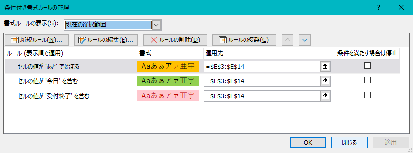
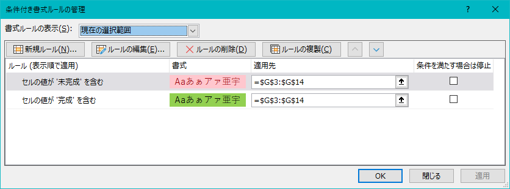
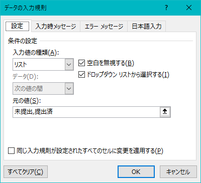
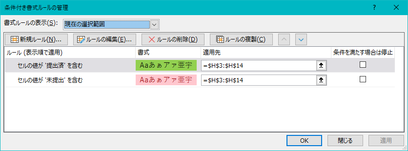

# 各科目の課題リスト

## 全体図

## 構成要素の解説

* [課題登録シート](シート_課題登録.md)の登録マクロを利用するので、一部例外を除き**手動で編集はしない**

### I1
* 本日の日付を表示
  ```
  =TODAY()
  ```
  特にこだわりはない

### 課題ナンバー
#### 概要
* 課題の番号を付与する
  * テーブルの機能により自動付与

#### 補足

### 表題
#### 概要
* 課題の表題を表示
  *  [課題登録シート](シート_課題登録.md#c4表題)内のセル`C4`の値を格納
#### 補足

### 課題提示日
#### 概要
* 課題が提示された日を表示する
  *  [課題登録シート](シート_課題登録.md#c4表題)内のセル`C5`の値を格納
#### 補足
* 手動で変更することも可能
  * 詳しくは[シート_課題登録](シート_課題登録.md#c5課題提示日)を参照

### 納期
#### 概要
* 課題の提出期限を表示
  *  [課題登録シート](シート_課題登録.md#c6課題提出期限)内のセル`C5`の値を格納
#### セルの色

|場合|条件式|フォントの色|塗りつぶしの色|
|:---:|:---:|:---:|:---:|
|期日経過後|セルの値 次より小さい =$I$1|#9C0006|#FFC7CE|
|今日|セルの値 次の値に等しい =$I$1|自動 （#000000）|#92D050|
|余裕あり|セルの値 次の値より大きい =$I$1|自動 （#000000）|#FFC000|
#### 補足
* 手動で変更することも可能
  * 詳しくは[シート_課題登録](シート_課題登録.md#c5課題提示日)を参照

### 期日
#### 概要
* 本日の日付と納期を比較した結果を表示
* 関数
  ```
  =IF(-($I$1-[@納期])<0,"受付終了",IF(-($I$1-[@納期])=0,"今日","あと"&-($I$1-[@納期])&"日"))
  ```
    * セル`I1`から納期を引いた結果
      * 0以下なら`受付終了`
      * 0なら`今日`
      * それ以外は`あとX日`
#### セルの色

|場合|条件式|フォントの色|塗りつぶしの色|
|:---:|:---:|:---:|:---:|
|受付終了|セルの値 次の値に等しい ="受付終了"|#9C0006|#FFC7CE|
|今日|特定の文字列 次の値を含む 今日|自動 （#000000）|#92D050|
|あとX日|特定の文字列 次の値を含む あと*日|自動 （#000000）|#FFC000|

### 命名規則
* 科目名を表示する
* シート名を取得する関数を利用
    ```
    =RIGHT(CELL("filename",$A$1),LEN(CELL("filename",$A$1))-FIND("]",CELL("filename",$A$1)))
    ```

### 進捗状況
#### 概要
* 課題の進捗状況を表示
#### データの入力規則

* 入力できる値の制限を行う

#### 完成⇔未完成の切り替え
* ダブルクリックで`完成`と`未完成`を切り替える
    ```
    If Target.Column And Target.Column = 7 Then
    
        If Target.Value = "未完成" Then
            Target.Value = "完成"
        ElseIf Target.Value = "完成" Then
            Target.Value = "未完成"
        Else
        
        End If
    End If
    ```
#### セルの色

|場合|条件式|フォントの色|塗りつぶしの色|
|:---:|:---:|:---:|:---:|
|未完成|セルの値 次の値に等しい ="未完成"|#9C0006|#FFC7CE|
|完成| セルの値 次の値に等しい ="完成"|自動 （#000000）|#92D050|

### 提出状況
* 課題の提出状況を表示
#### 概要
* 課題の進捗状況を表示
#### データの入力規則

* 入力できる値の制限を行う

#### 完成⇔未完成の切り替え
* ダブルクリックで`提出`と`未提出`を切り替える
    ```
    If Target.Column And Target.Column = 8 Then
    
        If Target.Value = "未提出" Then
            Target.Value = "提出済"
        ElseIf Target.Value = "提出済" Then
            Target.Value = "未提出"
        Else
        
        End If
    End If
    ```
#### セルの色

|場合|条件式|フォントの色|塗りつぶしの色|
|:---:|:---:|:---:|:---:|
|未提出|セルの値 次の値に等しい ="未提出"|#9C0006|#FFC7CE|
|提出済| セルの値 次の値に等しい ="提出済"|自動 （#000000）|#92D050|

### 備考
* 課題の備考を表示する
  *  [課題登録シート](シート_課題登録.md#c4表題)内のセル`C7`の値を格納
#### 補足
* 手動で変更することも可能

### 課題を削除するとき
* 行ごと削除する
