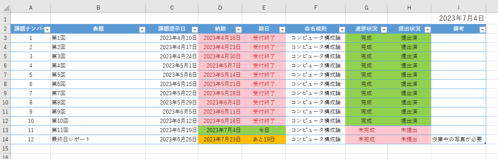
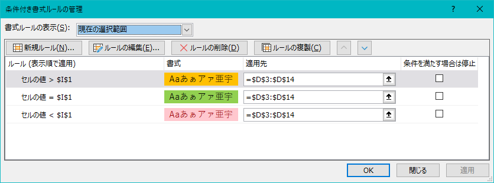

# 各科目の課題リスト

## 全体図

## 構成要素の解説

* [課題登録シート](シート_課題登録.md)の登録マクロを利用するので、一部例外を除き**手動で編集はしない**

### I1
* 本日の日付を表示
  ```
  =TODAY()
  ```
  特にこだわりはない

### 課題ナンバー
#### 概要
* 課題の番号を付与する
  * テーブルの機能により自動付与

#### 補足

### 表題
#### 概要
* 課題の表題を表示
  *  [課題登録シート](シート_課題登録.md#c4表題)内のセル`C4`の値を格納
#### 補足

### 課題提示日
#### 概要
* 課題が提示された日を表示する
  *  [課題登録シート](シート_課題登録.md#c4表題)内のセル`C5`の値を格納
#### 補足
* 手動で変更することも可能
  * 詳しくは[シート_課題登録](シート_課題登録.md#c5課題提示日)を参照

### 納期
#### 概要
#### 概要
* 課題の提出期限を表示
  *  [課題登録シート](シート_課題登録.md#c6課題提出期限)内のセル`C5`の値を格納
#### セルの色

* 期日経過後
  * 式 
    ```
    セルの値 次より小さい =$I$1
    ```
  * フォントの色
    ```
    #9C0006
    ```
  * 塗りつぶしの色
    ```
    #FFC7CE
    ```
* 今日
  * 式
    ```
    セルの値 次の値に等しい =$I$1
    ```
  * フォントの色
    ```
    自動 （#000000）
    ```
  * 塗りつぶしの色
    ```
    #92D050
    ```
* 余裕あり
  * 式
    ```
    セルの値 次の値より大きい =$I$1
    ```
  * フォントの色
    ```
    自動 （#000000）
    ```
  * 塗りつぶしの色
    ```
    #FFC000
    ```
#### 補足
* 手動で変更することも可能
  * 詳しくは[シート_課題登録](シート_課題登録.md#c5課題提示日)を参照
