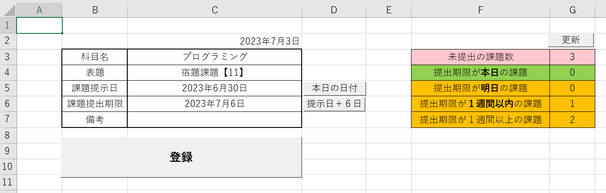

# 課題登録シート

## 全体図


## 構成要素の解説
### C2
#### 概要
* 日付の表示
    ```
    =TODAY()
    ```
特に深い意味はない

### C3（科目名）
#### 概要
* 科目名を選択する
* `データの入力規則`にてプルダウンから選択する
  * 詳しくは[Debugシート](Debug.md)を参照
#### 注意
* セル`C3`と各科目のシート名が一致していないと、マクロ[Registration](../bas/Registration.bas)が不具合を起こす
  * シート[Template](Template.md)から作成する事により回避可

### C4（表題）
#### 概要
* 課題のタイトルを入力する

### C5（課題提示日）
#### 概要
* 日付を選択する
  * セルをダブルクリックするとカレンダーフォーム画が表示される 
* カレンダーフォームを表示する条件式
    ```
    IF 5 <= Target.Row And Target.Row <= 6 Then
    ```
#### 注意
* 手動でも入力可能
#### 参考
[ダウンロードとコピペで使えるExcelVBAのカレンダーコントロール - ateitexe](https://ateitexe.com/excel-vba-calendar-control2/)

### C6（課題提出期限）
* [C4（課題提示日）](#c5課題提示日)を参照

### C7（備考）
#### 概要
* メモを入力する

### 登録ボタン
* `C4`から`C7`に入力された値を`C3`で選択された科目名を基に科目シートに転記する
* 登録しているプロシージャ
  * [Registration.bas](../bas/Registration.bas)
#### 注意
* ブック起動後の初実行は遅い
  * PowerQueryの読み込みに時間がかかる

### 本日の日付ボタン
#### 概要
* セル`C5`に本日の日付を出力する
* 適用しているマクロ
    * [InstDate.bas](../bas/InstDate.bas) - today

### 提示日+ 6ボタン
#### 概要
* セル`C5`の値に6を加算した値を`C6`に出力
  * ほとんどの課題は提示日から6日後の23:59を期限としているため
* 適用しているマクロ
  * [InstDate.bas](../bas/InstDate.bas) - nextweek
#### 注意
* セル`C5`が空白だと正常な値が出力されない

### G3（未提出の課題数）
#### 概要
* シート[課題管理](課題管理.md)内にあるテーブル`課題管理`から`未提出`の課題数をカウントする
* 関数
    ```
    =COUNTIFS(課題管理[期日],"<>受付終了",課題管理[提出状況],"未提出")
    ```
    * 期日が`受付終了ではない`かつ提出状況が`未提出`である
#### 補足
* `F3:G3`のセルの色`#FFC7CE`(HEX)を適用
* マクロでなく関数を利用している

### G4（提出期限が本日の課題）
* 期日が`今日`かつ提出状況が`未提出`の数をカウントする
* 適用しているマクロ
  * [kadaicount.bas](bas\Kadaicount.bas)
  * マクロの動きは[kadaicount.bas](bas\Kadaicount.bas)内のコメントを参照
#### 補足
* `F4:G4`のセルの色は`#92D050`(HEX)を適用
### G5（提出期限が明日の課題）
* 期限が`あと1日`かつ提出状況が`未提出`の課題をカウントする。
* 適用しているマクロ
  * [kadaicount.bas](bas\Kadaicount.bas)
  * マクロの動きは[kadaicount.bas](bas\Kadaicount.bas)内のコメントを参照
#### 補足
* `F5:G5`のセルの色は`#FFC000`(HEX)を適用

### G6（提出期限が1週間以内の課題）
* 期限が以下の式に当てはまり、提出状況が`未提出`の課題をカウント
    ```
    Nissu = Cells(i,4) - Date
    If 2 <= Nissu And Nissu <= 7 Then
    ```
    1. 本日の日付と納期納期の差を取得
    2. その差が2以上7以下ならTrueを返す
* 適用しているマクロ
  * [kadaicount.bas](bas\Kadaicount.bas)
  * 詳しいマクロの動きは[kadaicount.bas](bas\Kadaicount.bas)内のコメントを参照
#### 補足
* `F6:G6`のセルの色は`#FFC000`(HEX)を適用

### G7（提出期限が1週間以上の課題）
* 提出状況が`未提出`で他の条件式に合致しなかったセルの数をカウント
* 適用しているマクロ
  * [kadaicount.bas](bas\Kadaicount.bas)
  * 詳しいマクロの動きは[kadaicount.bas](bas\Kadaicount.bas)内のコメントを参照
#### 補足
* `F7:G7`のセルの色は`#FFC000`(HEX)を適用

### 更新ボタン
* 実行されるマクロ
  * [kadaicount.bas](bas\Kadaicount.bas)

# 参考
* [ダウンロードとコピペで使えるExcelVBAのカレンダーコントロール - ateitexe](https://ateitexe.com/excel-vba-calendar-control2/)
