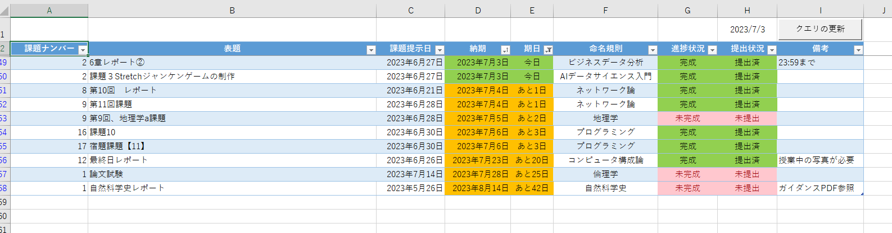

# 課題管理シート
## 全体図


## 構成要素の解説

### 課題管理テーブル
* 基本的にはPowerQueryを用いてテーブルのデータを取得している
    * PowerQueryについて
        * [UsePowerQuery](UsePowerQuery.md)
    * 各セルの値や色は[シート_各科目](シート_各科目.md)の値を利用

### H1
#### 概要
* 本日の日付を表示
    ```
    =TODAY()
    ```
    特にこだわりはない

### クエリ更新ボタン
#### 概要
* 実行されるマクロ
    * [Query_Refresh](bas\Query_Refresh.bas)
    * ショートカットキー`Ctrl`+`P`でも実行可能

#### 補足
* 初回実行時は遅い
    * .NET Frameworkやバックグラウンドクエリを実行しているらしい