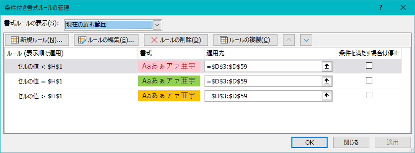

# 課題管理シート
## 全体図


## 構成要素の解説
### 課題管理テーブル
#### 概要
* 基本的にはPowerQueryを用いてテーブルのデータを取得している
    * PowerQueryについて
        * [UsePowerQuery](UsePowerQuery.md)
    * 各セルの値や色は[シート_各科目](シート_各科目.md)の値を利用

* 上図はテーブルの機能である`フィルター`を利用して`期日`から`受付終了`のレコードを非表示にしている

#### セルの色について
##### 納期

* 期日経過後
  * 式 
    ```
    セルの値 次より小さい =$I$1
    ```
  * フォントの色
    ```
    #9C0006
    ```
  * 塗りつぶしの色
    ```
    #FFC7CE
    ```
* 今日
  * 式
    ```
    セルの値 次の値に等しい =$I$1
    ```
  * フォントの色
    ```
    自動 （#000000）
    ```
  * 塗りつぶしの色
    ```
    #92D050
    ```
* 余裕あり
  * 式
    ```
    セルの値 次の値より大きい =$I$1
    ```
  * フォントの色
    ```
    自動 （#000000）
    ```
  * 塗りつぶしの色
    ```
    #FFC000
    ```

##### 期日

* 受付終了
  * 式 
    ```
    セルの値 次の値に等しい ="受付終了"
    ```
  * フォントの色
    ```
    #9C0006
    ```
  * 塗りつぶしの色
    ```
    #FFC7CE
    ```
* 今日
  * 式
    ```
    特定の文字列 次の値を含む 今日
    ```
  * フォントの色
    ```
    自動 （#000000）
    ```
  * 塗りつぶしの色
    ```
    #92D050
    ```
* あとX日
  * 式
    ```
    特定の文字列 次の値を含む あと*日
    ```
  * フォントの色
    ```
    自動 （#000000）
    ```
  * 塗りつぶしの色
    ```
    #FFC000
    ```

##### 提出状況・進捗状況


* 未完成・完成
  * 式 
    ```
    セルの値 次の値に等しい ="未完成"
    ```
    ```
    セルの値 次の値兄等しい ="未提出"
    ```
  * フォントの色
    ```
    #9C0006
    ```
  * 塗りつぶしの色
    ```
    #FFC7CE
    ```
* 完成・提出済
  * 式
    ```
    セルの値 次の値に等しい ="完成"
    ```
    ```
    セルの値 次の値兄等しい ="提出済"
    ```
  * フォントの色
    ```
    自動 （#000000）
    ```
  * 塗りつぶしの色
    ```
    #92D050
    ```

### H1
#### 概要
* 本日の日付を表示
    ```
    =TODAY()
    ```
    特にこだわりはない
#### 補足
* 書式を`長い日付形式`に変更

### クエリ更新ボタン
#### 概要
* 実行されるマクロ
    * [Query_Refresh](bas\Query_Refresh.bas)
    * ショートカットキー`Ctrl`+`P`でも実行可能

#### 補足
* 初回実行時は遅い
    * .NET Frameworkやバックグラウンドクエリを実行しているらしい

# 参考
* [【Excelパワークエリ】複数のテーブルを結合する【テーブルもしくはブックからクエリを作成】- 大体でIT](https://daitaideit.com/excel-powerquery-join-multi-table/)
