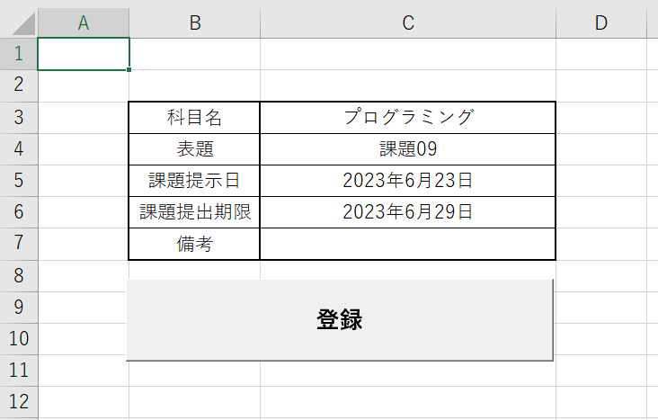
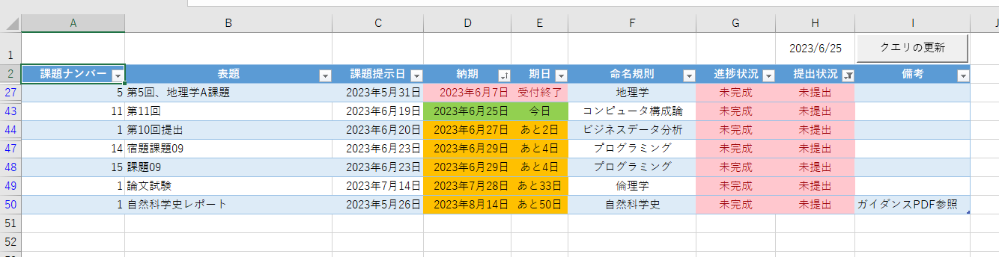
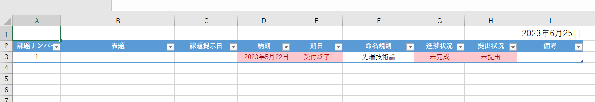
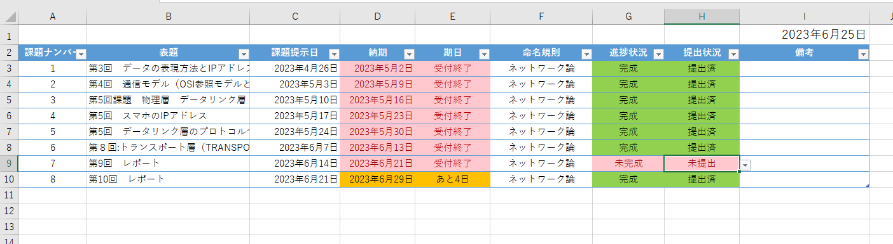
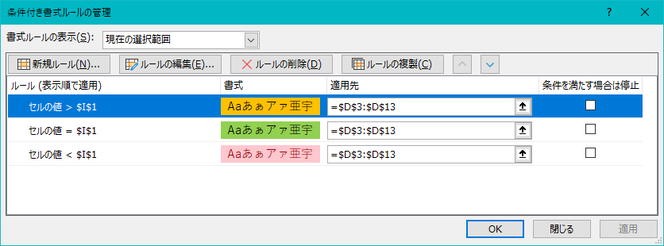
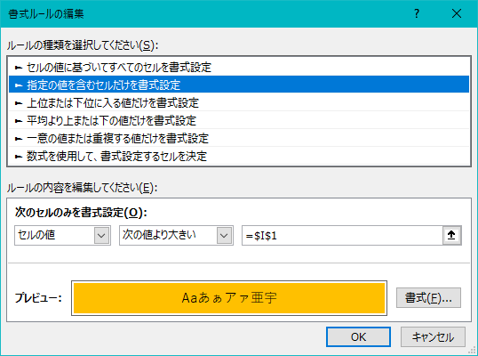
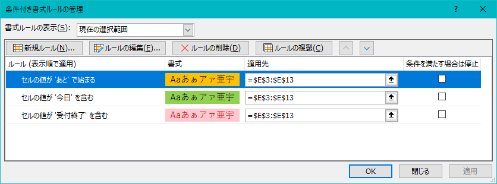
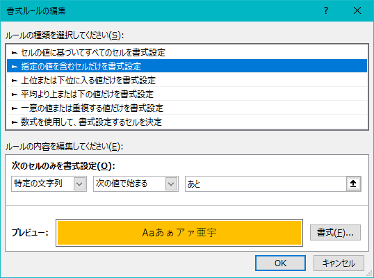

# 宿題を管理するやーつ
## 動作する環境
* Microsoft Excel
  * マクロ有効ブックが動作する環境
    * モバイル版やブラウザ版では動作しません

## 解説
### 課題登録シート

#### 各セルの解説
##### C3（科目名）
* 科目をプリダウンメニューから選択する
* [入力規則](#データの入力規則) 参照
##### C4（表題）
* 課題名を手動で入力
##### C5（課題提示日）
* [課題提示日](#visual-basic-for-application) 適応
##### C6（課題提示期限）
* [課題提示日](#visual-basic-for-application) 適応
##### C7（備考）
* メモを手動入力
#### Visual Basic for Application
  * [標準モジュール - Registration.bas](bas/Registration.bas)
    * 詳細はコメントアウトを確認
    * ボタン１(登録)とリンク
  * [ダウンロードとコピペで使えるExcelVBAのカレンダーコントロール - ateitexe](https://ateitexe.com/excel-vba-calendar-control2/)
    * カレンダーの実装
    * 特定のセルをダブルクリックするとカレンダーフォームが表示される
    * このシートでは`課題提示日`と`課題提出期限`で利用
#### データの入力規則
* 設定
  1. 設定セルをアクティブにする
  2. データタブを選択
  3. `データツール`内の`データの入力規則`を選択
  4. `設定`タブの`入力の種類`を`リスト`にする
  5. `元の値`を編集する
     * 各科目シートのシート名と一致していないと[標準モジュール - Registration.bas](#visual-basic-for-application)がエラーとなる
     * 初期値
        ```
        コンピュータ構成論,倫理学,ビジネスデータ分析,データサイエンス入門,ネットワーク論,先端技術論,地理学,日本史,特別B,自然科学史,プログラミング,生涯スポーツ論
        ```

### 課題管理シート

#### Power Query
* [【Excelパワークエリ】複数のテーブルを結合する【テーブルもしくはブックからクエリを作成】- 大体でIT](https://daitaideit.com/excel-powerquery-join-multi-table/)

  * 各シートのテーブルを結合しひとつのデータにまとめる
  * テーブル設定しているのでソートや並び替えが可能
#### Visual Basic for Application
* [Query_Refresh.bas](bas/Query_Refresh.bas)
  * クエリの更新ボタン

### 各科目シート
* 初期例（各科目分シートを複製する）


* 利用例

#### Visual Basic for Application
* カレンダーを手動で編集するのに利用
* [ダウンロードとコピペで使えるExcelVBAのカレンダーコントロール - ateitexe](https://ateitexe.com/excel-vba-calendar-control2/) の「特定の列/行だけ」を参照する
#### テーブル
* VBAやPower Queryでテーブルを管理するために利用
* 自動でオートフィルを実行し書式を設定してくれる
* 注意
  * シート名とテーブル名を一致させる 
    * [Registration.bas](#visual-basic-for-application)がエラーになる
  * 課題が存在しなくてもひとつは登録しておく
    * 登録時にオートフィル機能を利用するため 
    * ひとつめの課題は手動で編集する

#### 各セルの関数
基本的にマクロや関数などExcelの機能で設定するので触らない方がいい
##### I1
* 日付の設定
* `=Today()`
##### A3（課題ナンバー）
* テーブルのオートフィルにより自動入力
##### B3（表題）
* 対応セル `課題登録!C3`
##### C3（課題提示日）
* [カレンダーマクロ](#visual-basic-for-application-2)での補完可能
* 対応セル `課題登録!C4`
##### D3（納期）
* [カレンダーマクロ](#visual-basic-for-application-2)での補完可能
* 対応セル `課題登録!C5`
* 条件付き書式
  * 指定の値を含むセルの書式設定
    |ルール|塗りつぶしの色（FEX）|
    |:---:|:---:|
    |セルの値 > $I$1 | #FFC000 |
    |セルの値 = $I$1 | #92D050 |
    |セルの値 < $I$1 | #FFC7CE |
    * 設定例
      
      
##### E3（期日）
* 関数
  ```
  =IF(-($I$1-[@納期])<0,"受付終了",IF(-($I$1-[@納期])=0,"今日","あと"&-($I$1-[@納期])&"日"))
  ```
* 条件付き書式
  * 指定の値を含むセルの書式設定
    |ルール|塗りつぶしの色（FEX）|
    |:---:|:---:|
    |セルの値が'あと'で始まる | #FFC000 |
    |セルの値'今日'を含む  | #92D050 |
    |セルの値が'受付終了'を含む | #FFC7CE |
    * 設定例
      * 
      * 
##### F3（命名規則）
* シート名を表示する
  * Power Queryを適用時に科目を識別するため
* 関数
  ```
  =RIGHT(CELL("filename",$A$1),LEN(CELL("filename",$A$1))-FIND("]",CELL("filename",$A$1)))
  ```
  * [【コピペOK】Excelでシート名を取得する方法の基本と応用－シート名を使った活用例 - ワカルニ](https://briarpatch.co.jp/wakaruni/excel-sheetname-acquisition/)
##### G3（進捗状況）
* 入力規則の設定
  * 設定方法は [#データの入力規則](#データの入力規則)を参考にする
  * 元の値
      ```
      未完成,完成
      ```
* 条件付き書式
  * 指定の値を含むセルの書式設定
    |ルール|塗りつぶしの色（FEX）|
    |:---:|:---:|
    |セルの値'完成'を含む  | #92D050 |
    |セルの値が'未完成'を含む | #FFC7CE |
##### H3（提出状況）
* 入力規則の設定
  * 設定方法は [#データの入力規則](#データの入力規則)を参考にする
  * 元の値
    ```
    未提出,提出済み
    ```
* 条件付き書式
  * 指定の値を含むセルの書式設定
    |ルール|塗りつぶしの色（FEX）|
    |:---:|:---:|
    |セルの値'提出済み'を含む  | #92D050 |
    |セルの値が'未提出'を含む | #FFC7CE |
##### I3（備考）
* 対応セル `課題登録!C4`

## 参考
* [ダウンロードとコピペで使えるExcelVBAのカレンダーコントロール - ateitexe](https://ateitexe.com/excel-vba-calendar-control2/)
* [【Excelパワークエリ】複数のテーブルを結合する【テーブルもしくはブックからクエリを作成】- 大体でIT](https://daitaideit.com/excel-powerquery-join-multi-table/)
* [【コピペOK】Excelでシート名を取得する方法の基本と応用－シート名を使った活用例 - ワカルニ](https://briarpatch.co.jp/wakaruni/excel-sheetname-acquisition/)
* [image.md - github](https://gist.github.com/Tatzyr/3847141)
